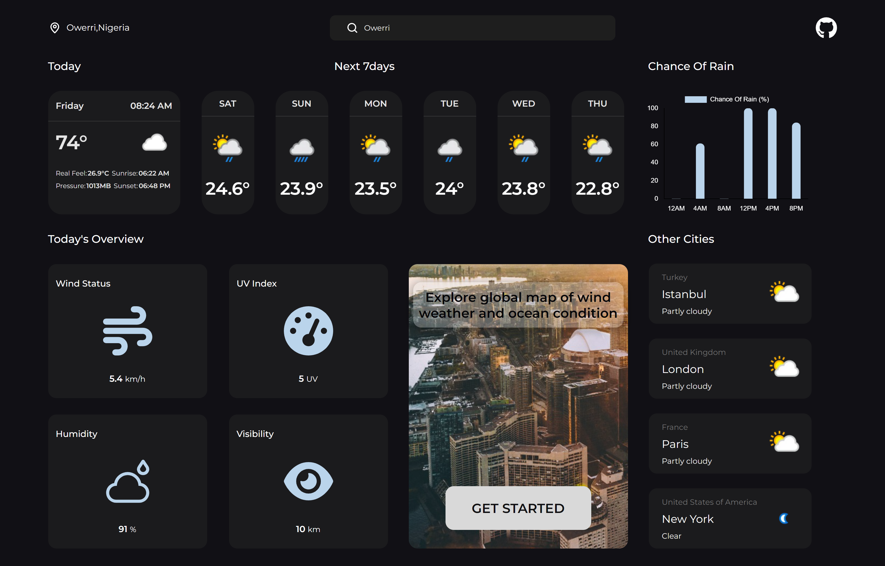

# Sky Cast - A Weather Dashboard
***USE LARGE SCREENS FOR BEST EXPERIENCE***

SkyCast is a user-friendly weather dashboard that provides real-time weather information for your desired locations. It displays current weather conditions, forecasts, and other relevant details in a visually appealing interface.

###

###

## Features:

- Search for weather information by city name.
- View current weather conditions, including temperature, humidity, wind speed, chance of rain, feels like, and weather description.
- Access extended forecast for upcoming days.
- Access wind, weather and ocean condition global map.

###

###

## Getting Started Locally:

- Clone the repository:

```bash
git clone https://github.com/favorodera/skyCast.git
```

- Install dependencies:

```bash
pnpm install
```

- Start the development server:

```bash
pnpm dev
```

###

###

## Contribute and Share:

- SkyCast is an open-source project! Feel free to contribute by submitting pull requests.
- Report any bugs or suggest improvements through GitHub issues.

###
